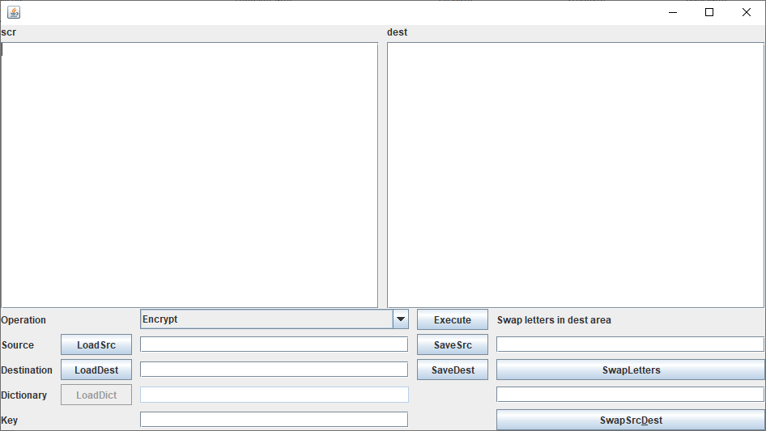

Bogdanov Mikhail project
## Задача
Написать программу, которая работает с шифром Цезаря.
За основу криптографического алфавита возьми все буквы русского алфавита и знаки пунктуации (. , ”” : - ! ? ПРОБЕЛ). Если попадаются символы, которые не входят в наш криптографический алфавит, просто пропусти их.

### Обязательные требования
У программы должно быть 2 режима:

1) Шифрование / расшифровка. Программа должна зашифровывать и расшифровывать текст, используя заданный криптографический ключ.
Программа должна получать путь к текстовому файлу с исходным текстом и на его основе создавать файл с зашифрованным текстом.

2) Криптоанализ методом brute force
Программа должна взламывать зашифрованный текст, переданный в виде текстового файла.
Если пользователь выбирает brute force (брутфорс, поиск грубой силой), программа должна самостоятельно, путем перебора, подобрать ключ и расшифровать текст.
Подумай, какой критерий программа должна воспринимать как сигнал успешного подбора ключа. Возможно, нужно обратить внимание на пробелы между словами или правильность использования знаков пунктуации.

### Дополнительные требования(опционально)

1) Криптоанализ методом статистического анализа
У пользователя программы должна быть возможность выбрать один из двух методов криптоанализа. Если пользователь выбирает метод статистического анализа, ему нужно предложить загрузить еще один дополнительный файл с текстом, желательно— того же автора и той же стилистики. На основе загруженного файла программа должна составить статистику вхождения символов и после этого попытаться использовать полученную статистику для криптоанализа зашифрованного текста.

2) User Interface
Все диалоговые окна с пользователем делай на свое усмотрение. При желании можно использовать графические фреймворки Swing, JavaFX.

## Реализация криптоанализатора v1.0
1) Интерактивная консоль, функции шифрования, дешифровки по ключу, перебором и статистическим анализом;
2) Осуществляется проверка введенных данных для каждой функции;
3) Шифрование и дешифровка по ключу работают без ошибок;
4) Brute force анализирует текст по трем параметрам (количество пробелов, точек и запятых);
5) Статистический анализ считает количество символов в исходном тексте и словаре и сопоставляет символы 
(для больших текстов и словарей можно разобрать некоторые слова и вручную дорасшифровывать);

## Реализация криптоанализатора GUIv1.0

1) Запуск:
- для запуска необходимо иметь на компьютере `Java 17` (не ниже), `Maven v3.8.6`
- скачать архив проекта, распаковать
- открыть консоль в месте распаковки (там, где находится папак src), выполнить команду `$ mvn package`
- после этого появится папка target с файлом `CryptoAnalizer-1.0-with-dependencies.jar` который можно запустить ИЛИ в месте, где находится jar файл открыть консоль и выполнить `$ java -jar CryptoAnalizer-1.0-with-dependencies.jar`
2) GUI

   
3) Не все кейсы валидации будут работать (например при свапе букв не будет проверяться, что каждой буквы должно быть по одной или не будут проверяться отсутствие файла ввода/вывода)
4) Есть функция поменять букву (полезно для статистического анализа), поменять местами тексты в полях src/dest
5) Не забывать сохранять файл перед выполнением операции